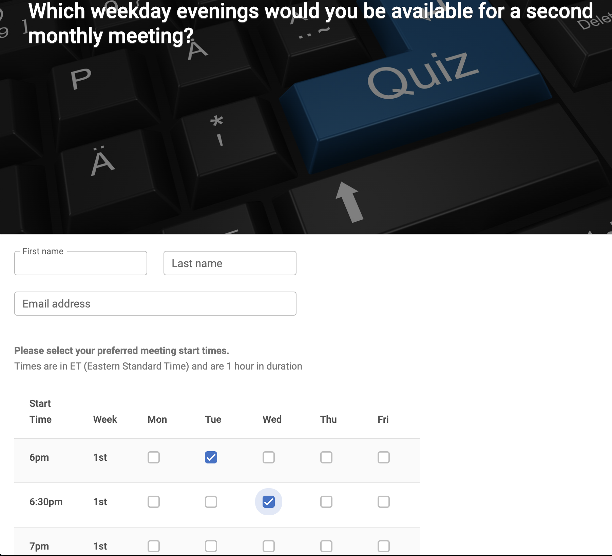
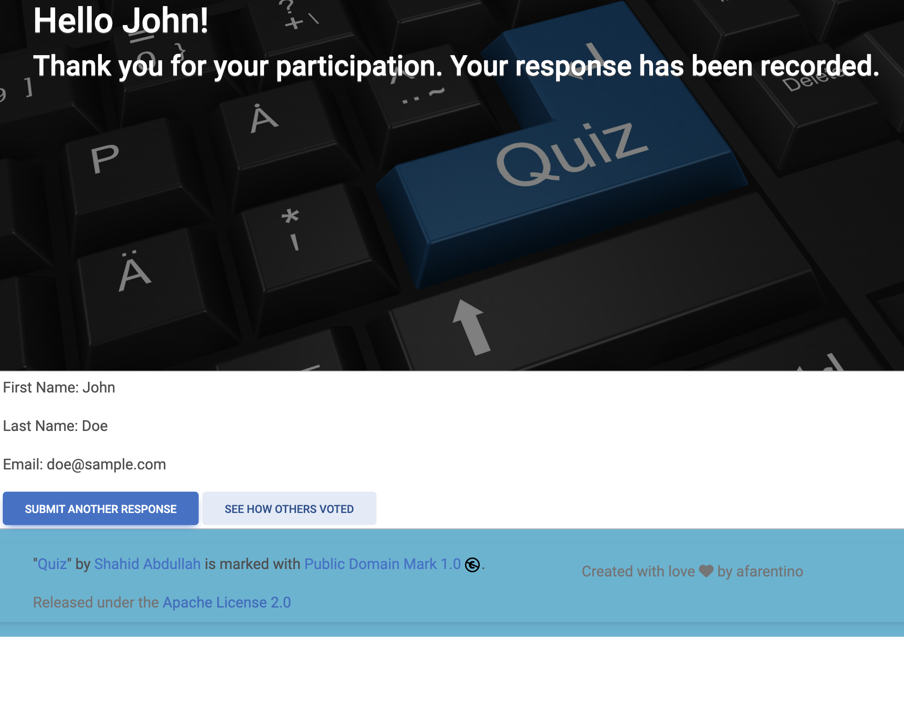

# Poll
Poll is a web application that presents site
visitors with a simple single question survey.

## Motivation

The software in this repository was used to quickly build 
and release an application with just enough features for a [Minimum Viable Product (MVP)](https://www.productplan.com/glossary/minimum-viable-product/).

I used it to run a short-lived survey for a small virtual monthly public speaking meeting I co-host called Beyond Soft Talk (BSG).

## Screenshots
When a user initially visits the site, they are presented with the 
following "Welcome" page:

After making their selections and hitting the submit button (not pictured)
users are redirected to the following "Thank You" page:

### Design Goals
The core design constraint of this project requires that the system
be Cloud/Deployment environment agnostic.  

Anyone could easily fork this code and deploy it to an on-premises or cloud environment without having to redesign or rewrite the application.

I also wanted to avoid introducing extra third-party dependencies on
popular No-Code Form Builders such as [SurveyMonkey](https://www.surveymonkey.com/), [Cognito Forms](https://www.cognitoforms.com/), and [Google Forms](https://www.google.com/forms/about/).  

## Technologies Used
* Java 17
* Modern Vanilla JavaScript - runs in any ES6+ web browser
* [Spring Boot 3.0+](https://spring.io/blog/2022/05/24/preparing-for-spring-boot-3-0) 
* [ThymeLeaf Java template engine](https://www.thymeleaf.org/) 
* [MDBootstrap](https://mdbootstrap.com/) 
* [MongoDB Atlas](https://www.mongodb.com/atlas/database) NoSQL document database - to store survey results
* Gradle 7.6

## Deployment and Hosting

### Intended Audience and Prerequisites ###
This section of the guide is written for a developer interested in cloning this repository to modify it or deploy it as-is to their own environment.
To use it, a basic knowledge of MongoDB Cloud Atlas db administration is required
1. Setting up an account 
2. Creating the required database (answers0) 
3. Extracting the correct connection string to use from Spring

If you are interested in additional details on these pre-reqs up I'm happy to provide them.

Any cloud provider can be used (AWS, Azure, Heroku, GCP).  

For its ease of use and ability to scale from 0 to n instances as needed on demand I chose [Google Cloud Platform App Engine](https://cloud.google.com/appengine/docs).  

### GCP App Engine Local Build + Deployment

The following steps can be run from a Unix-based Terminal.  I'm using `bash` as my shell in the samples below.  

Following these steps, keeps development costs down, as we essentially assemble the binary artifacts GCP requires for execution in an APP ENGINE environment ahead of time (on a local development or build server). It also allows the application to be spun up only when users clicked a link shared with them via email.

1. Create a GCP cloud account
2. Follow [Google's online guide](https://cloud.google.com/sdk/docs/install) to download + install the `gcloud` CLI  
   ℹ️ **Note:** Make sure you have the recommended version of Python installed locally as outlined in the docs
3. Use git to clone this repositories main branch
4. Change directories to the top-level directory of the poll project `cd $projectDir`
5. Set the APP_MONGODB_CONN environment variable to the value consistent with your MONGODB Cloud Atlas cluster
6. Use the Gradle wrapper to run the bootJar task `./gradlew bootJar`  
   ℹ️ **Note:** An executable jar file will be assembled and generated to `$projectDir/build/libs`
7. Use the Gradle wrapper to run the custom generateAppYaml task `./gradlew generateAppYaml`  
   ℹ️ **Note:** An updated `app.yaml` that contains the value of `APP_MONGODB_CONN` will be generated to `$projectDir/build/libs`
8. `cd $projectDir/build/libs`
9. Run `gcloud app deploy ./poll-0.0.3.SNAPSHOT.jar --appyaml=./app.yaml`  
   ℹ️ **Note:** If deployment succeeds, GCP App Engine will share the URL of your running application with you in the console

## Limitations
1. At this time, it is a heavy lift to design, add or display alternate questions. To make this single-question poll survey reusable in other contexts, a configurable question provider would be a great feature to have.  
ℹ️ **Note:** See [GitHub issue #2](https://github.com/afarentino/poll/issues/2) for further details.

2. Deployment instructions (for additional cloud platforms) and automated steps to provision any required infrastructure (including the MongoDB Atlas database) would also be a nice-to-have. 

## Contributing

Creating new opportunities for innovation and collaboration is what make open source software special.

If you would like to use this code in a derived work of your own, please [fork the repository](https://docs.github.com/en/pull-requests/collaborating-with-pull-requests/working-with-forks).  

If you have any changes you would like to potentially contribute back simply [create a pull request](https://docs.github.com/en/pull-requests/collaborating-with-pull-requests/proposing-changes-to-your-work-with-pull-requests/creating-a-pull-request-from-a-fork).

Thanks!

## License
* [Apache 2.0](https://www.apache.org/licenses/LICENSE-2.0)

Copyright (c) 2023 Tony Castrogiovanni

